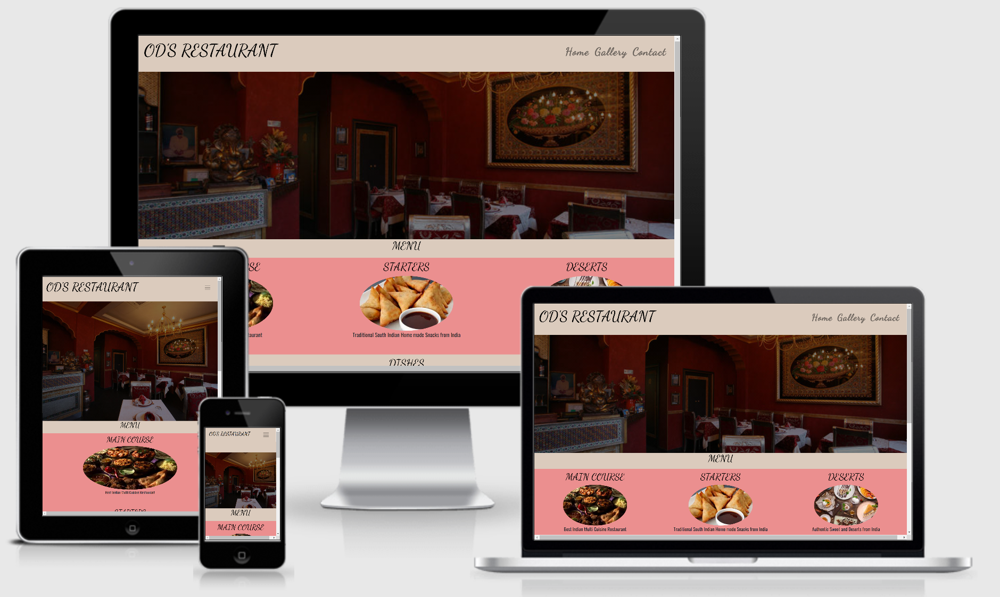

# OD'S Restaurant
### [GitHub](https://github.com/vijusuren/my-first-repo1)

# Milestone Project 1
## Table of Contents
* [**Project overview**](#project-overview)
* [**UX**](#ux-design)
  - [**User Stories**](#user-stories)
  - [**Design**](#design)
  - [**Libraries**](#libraries)
  - [**Colour Scheme**](#colour-scheme)
  - [**Wireframes**](#wireframes)

* [**Features**](#features)
  - [**Existing Features**](#existing-features)
  - [**Features Left to Implement**](#features-left-to-implemement)

* [**Technologies Used**](#technologies-used)

* [**Testing**](#testing)
  - [**Validators**](#validators)

* [**Deployment**](#deployment)

* [**Credits**](#credits)
  - [**Content**](#content)
  - [**Media**](#media)
  - [**Acknowledgements**](#acknowledgements)

## Project Overview
This Website was created for the purpose of completing the first Milestone Project for the Code Institute's Full Stack Developer Course.
It was build using the knowledge gained from the HTML, CSS, and User Centric Design Modules.

The live website can be found %md <a href="https://vijusuren.github.io/my-first-repo1/index.html" target="_blank">here</a>

The OD'S Restaurant Website was built by Own Imagination. The Items shown in this website are famous and delicious south Indian dishes.
***
## UX Design

- To create a website that is speaking directly to the viewer, giving a clear idea and description of the OD'S Restaurant.
- To create a responsive design fitting all devices and screen sizes.

## User Stories

- This website will give an information to the user about the Indian Restaurant.
- In a Home page, user can view Main Course, Starters and Desserts. As a user can click any one of this items will enter the Menu page.
- If user can click Main Course it will go to Main course in menu page.
- In case user click Starters in Home page will go to the Starters section in Menu page.
- In case user click Desserts in Home page will go to the Desserts section in Menu page.
- In the Menu page user can view list of Items. All these dishes are incredibly famous and delicious in India.
- List of Items in Main Courses:
    * Idli
    * Pongal
    * Chapati
    * Dosai
    * Parotta
    * Poori
    * Veg-Noodles
    * Veg-Biryani
    * Veg-Pulao
- List of Items in Starters:
    * Samosa
    * Masal Vadai
    * Onion Pakoda
    * Kuzhi Paniyaram
    * Bonda
    * Baji
    * Paneer-65
    * Babycorn fries
    * Paneer Tikka
- List of Items in Desserts:
    * Gulam Jamun
    * Rasmalai
    * Paneer Jamun
    * Carrot Halwa
    * Brownie
    * Strawberry Milkshake
    * Mango Lassie
    * Watermelon Juice
    * Ice Cream
- In the Gallery page user can view all the Images of Dishes. When the mouse pointer on the Image display the Name of the dishes.
- In the Contact page user can send the feedback through email.

## Design
### Libraries
- [Bootstrap 4.5](https://getbootstrap.com) - is a framework for building responsive, mobile-first websites.

- [Font](https://fonts.google.com/) - is a font application

### Colour Scheme

- Pantone
- Sweet Pink
- Pale Pink

### Wireframes

- [Desktop Wireframe](assets/wireframe/desk.pdf)
- [Tablet Wireframe](assets/wireframe/tab1.pdf)
- [Mobile Wireframe](assets/wireframe/phone.pdf)

##### back to [top](#table-of-contents)
---
## Features
### Existing Features

This project consists of 4 pages accessible from both the navbar and the footer.

### Consistent features across all pages

- The navbar menu at the top and footer at the bottom of the page are consistent and responsive throughout the website.
- Each page has different images.

### Home

- The Front Image shows the Image of Restaurant.
- In the Menu section having Main Course, Starters and Desserts. User can clicked on it goes to Menu Page.
- Slides of Images
- Footer contains contact details, social network, and address.

### Menu

- The user can see three menu sections in this page.
- The first section having main courses.
- Scrolling down, the user can see Starters section.
- Last user can see Desserts section.

### Gallery

- This page will contain grid Images of south Indian dishes.

### Contact

- The form's is used to get feedback from the user.

## Features Left to Implement

- A further features could be adding extra dishes in menu page.
- Implementing online orders.

##### back to [top](#table-of-contents)
---

## Technologies Used

- [HTML5](https://en.wikipedia.org/wiki/HTML)
    * The language used to create and sort the content of the website.
- [CSS](https://en.wikipedia.org/wiki/CSS)
    * The language used to style the HTML5 elements according to the design purposes.
- [Bootstrap framework](https://getbootstrap.com/)
    * I decided to use Bootstrap's grid container system as I wanted to design my project with a 'mobile first' approach.
- [Gitpod](https://www.gitpod.io/)
    * I relied on Gitpod's dev environment to write the code for my project.
- [GitHub](https://github.com/)
    * I hosted my deployed website to GitHub, with previous versions of my code stored through the commit history.
- [Balsamiq](https://en.wikipedia.org/wiki/Balsamiq)
    * I used Balsamiq to make Wireframes for the project in skeleton stage.

##### back to [top](#table-of-contents)
---

## Testing

- All testing has been made manually and have also been tested on different computers and phones.
- Google Devtools have been used to test the site on the following devices:
    * Moto G4
    * Galaxy S5
    * Pixel 2
    * Pixel 2 XL
    * iPhone 5/SE 
    * iPhone 6/7/8
    * iPhone 6/7/8 Plus 
    * iPhone X 
    * iPad
    * iPad Pro
    * Surface Duo 
    * Galaxy Fold. 
- Home Page
    * Image of Restaurant on website must load correctly.
    * Images on menu section must load correctly.
    * Image slide on the Home page must load correctly.
    * Social network links are direct to the correct page.
    * All elements on the Home page must be responsive and resized for different size of screen.
- Menu Page
    * Background Image on Menu page loaded correctly.
    * Tested Function of link from home page to specific section in menu page.
    * All elements on the Menu page must be responsive and resized for different size of screen.
- Gallery Page
    * All Images on gallery page are loaded correctly.
    * Display the name of dishes are displayed correctly.
    * All elements on the Gallery Page must be responsive and resized for different size of screen.
- Contact Page
    * Background Image on Contact page loaded correctly.
    * Tested Submit button on Contact page without any text in inputs to ensure that it provides the desired error of 'Please fill out this field' to appropriate required fields.
    * Tested Email entry input by not entering a valid email address. This provides the desired error of 'Please include an @ in the email address'.
    * Once user filled everything then click submit button it open outlook and able to send email.
- Tested overall site colour.
- Checked grammar and spelling throughout document.
- Ran README text through [Online-Spellcheck](https://www.online-spellcheck.com/) to double-check on grammar and spelling.
- Bugs
    * Control the Image size in different size of screen.
    * Fixed the navigation bar in different size of screen.
    * Fixed the gap between two images in Gallery page.

## Validators
#### HTML

- [W3C HTML Validator](https://validator.w3.org/) - Document checking Completed. No errors or warnings to show.

#### CSS

- [W3C CSS Validator](https://jigsaw.w3.org/css-validator/) - Congratulations! No Error Found.
##### back to [top](#table-of-contents)
---

## Deployment
### Deploying my project

I created my project on GitHub and used GitPod's development environment to write my code.
Use the following link to view my live project: [OD'S Restaurant](https://vijusuren.github.io/my-first-repo1/)

### Deploying to GitHub Pages
To make my project viewable to others, I deployed my project to GitHub Pages with the following process:

1. Got to [Github](https://github.com/) and log in.
2. Then go to [https://github.com/vijusuren/my-first-repo1](https://github.com/vijusuren/my-first-repo1).
3. Click [Settings](https://github.com/vijusuren/my-first-repo1/settings) in the tab menu above the content area.
3. Scroll to GitHub pages-section.
4. Then choose Master Branch from the source dropdown menu.
5. Click to confirm my selection, and then it's live.

To Clone this project from the GitHub:

1. Go to [https://github.com/vijusuren/my-first-repo1](https://github.com/vijusuren/my-first-repo1).
2. Click the “Code”-button and copy the http-address.
3. Open Gitpod and open a new terminal, terminal → new terminal.
4. In the terminal, paste the code and press enter.

More information about this process can be found on the following link: [Configuring a publishing source for your GitHub Pages site](https://help.github.com/en/github/working-with-github-pages/configuring-a-publishing-source-for-your-github-pages-site)
##### back to [top](#table-of-contents)
---

## Credits
### Content

The content of this website refers to a Imagination company. The website purpose is to look realistic.

- [Opening Image in the home page](https://www.elitetraveler.com/wp-content/uploads/2016/11/haveli-462x308.jpg)
- [Image of Main Course](https://footage.framepool.com/shotimg/qf/623800370-indian-cuisine-side-side-dish-main-course-asian-cuisine.jpg)
- [Image of Starters](https://encrypted-tbn0.gstatic.com/images?q=tbn%3AANd9GcSDa6-9BWRHZFxAJeCCc7Sjz-Z0c08ik1xX9w&usqp=CAU)
- [Image of Desserts](https://encrypted-tbn0.gstatic.com/images?q=tbn%3AANd9GcReTf7ogQNhUTKRzWDF2lDq32yfqIqd1AzdGA&usqp=CAU)
- [Image of Menu](https://www.primogrilltacoma.com/wp-content/uploads/2014/05/wood.jpg)
- [Image of Gallery](https://www.sangeethaveg.com/wp-content/uploads/2019/09/b12.jpg)
- [Image of Contact Page](https://pressup.ie/wp-content/uploads/2020/01/Interiors-2894.jpg)

### Media

- Image slide in Home pages shows some of the famous Indian Items. I got from [Bootstrap.com](https://getbootstrap.com/docs/4.0/components/carousel/) and I customized code for my site.
- [w3school](https://www.w3schools.com/) helps me to make Grid of Image in Gallery page.
- Menu page from [w3school](https://www.w3schools.com) and I customized for my site.
- Grid Image and overlay in Gallery page from [w3school](http://www.w3schools.com) and I customized for my site.
- Header and Footer from Resume Mini Project [Code Institute](https://courses.codeinstitute.net/courses/course-v1:codeinstitute+FE+2017_T3/courseware/616289d66b5641a3808cc43e53842695/f99dac3afcfe4b2caf8d576273aea3e6/?activate_block_id=block-v1%3Acodeinstitute%2BFE%2B2017_T3%2Btype%40sequential%2Bblock%40f99dac3afcfe4b2caf8d576273aea3e6) and I customized for my site.

### Acknowledgements

Thank you to the following people who helped with support, inspiration and guidance at different stages in the project:

- The guidance and support of my mentor Adegbenga Adeye
- The tutor support team
- The supportive *Code Institute* community.
- My family and friends for their patience.
##### back to [top](#table-of-contents)
